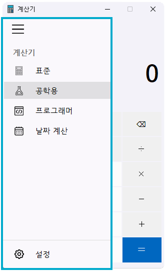
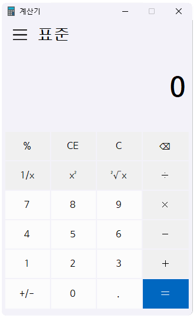
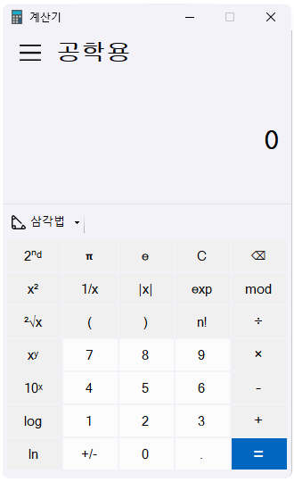
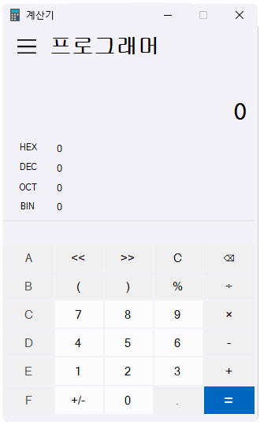
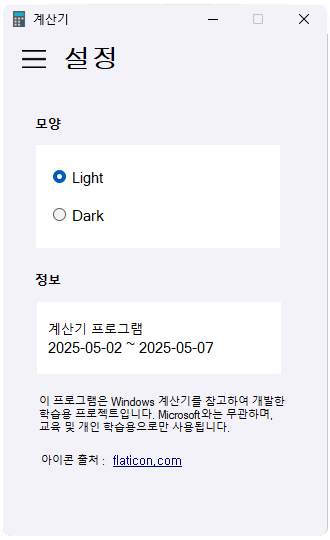
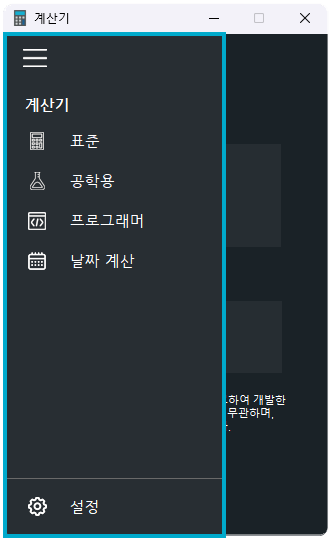
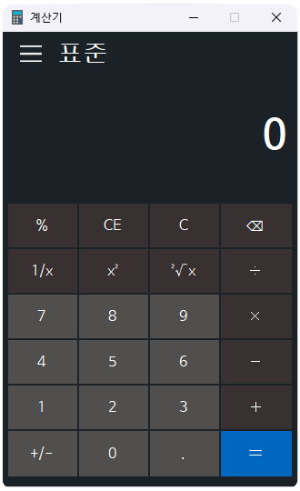
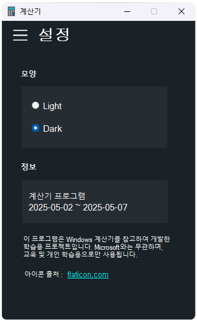

# 🧮 wincalc-pro C# WinForms 학습용 계산기
<br>

## 📌 프로젝트 개요
- **프로젝트 명** : **wincalc-pro**
- **주제** : 윈도우용 계산기 프로그램 (클론)
- **개발 기간** : 2025.05.02 ~ 2025.05.07(총 6일간)
  
- **의의** : 주도적 학습 + 복습 + 협업 경험
  - 아직 사용해보지 않은 속성(컬러, 폰트, 크기 등) 적용
  - 이벤트 처리 연습(마우스 조작, 키보드 입력, 컨트롤 변화 등)
  - 스스로 기능 정의 → 설계 → 구현의 전 과정을 직접 경험
<br>

## ✏️ 소개
WinCalcPro는 Windows 계산기를 참고하여 만든 **학습용 C# WinForms 계산기**입니다.  
표준 계산기부터 공학용, 프로그래머, 날짜 계산기까지 다양한 기능을 갖춘 데스크탑 애플리케이션으로,  
폼 전환, 사용자 정의 컨트롤, 이벤트 처리, 레이아웃 관리 등 WinForms 핵심 개념을 실습하고 학습하는 데 중점을 두었습니다.

⚠️ 본 프로젝트는 Microsoft 공식 계산기와는 관련이 없으며, **상업적 목적 없이 개인 학습 및 포트폴리오 목적으로 제작**되었습니다.  
> This project is not affiliated with the official Microsoft Calculator and was created solely for personal educational purposes without any commercial intent.

<br>

## 👥 팀원

| 최마리(리더)                            | 김철수                                                                 |
|:---------------------------------------:|:----------------------------------------------------------------------:|
|      |                                 |
|[@ChoiMari](https://github.com/ChoiMari) |[@r2d2c2](https://github.com/r2d2c2), [@cjftn](https://github.com/cjftn)|   

### ◽ 담당 역할(기능 분배)    
[최마리]
- 전체 UI
- 표준 계산기
- 설정(테마 변경)
- 메뉴바

[김철수]
- 공학용 계산기
- 프로그래머용 계산기

[기타]
- 발표 : 김철수
- 문서작성 : 최마리

<br>

## 🗓️ 일정표
 

<br>

## 🖥️ 구현 기능
- [x] **표준 계산기** : 사칙연산, 소수점, ± 변환 등
- [x] **공학용 계산기** : 삼각함수, 제곱근, 로그 등
- [x] **프로그래머 계산기** : 진수 변환 (2진수, 8진수, 16진수), 비트 연산
- [x] **설정(테마)** : Light/Dark mode 지원
- [x] **햄버거 메뉴** : 계산기 종류 전환 기능
- [x] **사용자 정의 컨트롤 분리** : 각 모드를 별도 UserControl로 설계
- [x] **Event Handler/콤보박스/ToolStrip등의 WinForms의 다양한 컨트롤 속성 실습** 포함

<br>

**구현 기술 기록서** https://www.notion.so/1e79879dac8680dfa18bf9335f022293#1e79879dac8680f6a79effc68a9e46b2

<br>
  
## 🛠️ 기술 스택 (Tech Stack)
- 언어 : C# 7.3
- 프레임워크 : .NET Framework 4.8
- UI 라이브러리 : Windows Forms (WinForms)
- IDE (통합 개발 환경): Visual Studio 2022
- Git / GitHub
- Slack , Notion

<br>

## 🖍️ 설계 및 구조
### UI 구조
- wincalc-pro는 C# Windows Forms(WinForms)를 기반으로 한 다기능 계산기 애플리케이션으로,
Form1을 메인 폼으로 사용하며 다양한 기능을 모듈화된 사용자 정의 컨트롤(UserControl)로 구현하고,
사이드바(햄버거 메뉴)를 통해 전환 및 접근할 수 있도록 설계되었습니다.
  
    

**동작 흐름 요약**

1. 사용자 메뉴 선택 시, 해당 `UserControl` 객체를 생성하여 `Form1`의 컨텐츠 영역에 `Controls.Add()` 방식으로 삽입.
2. 기존 컨트롤은 `Controls.Clear()`를 통해 제거하고, 새로운 컨트롤만 보여줌.
3. 설정 컨트롤에서 테마 설정 시, `Form1`의 테마 적용 메서드를 호출하여 전체 앱 스타일을 갱신.
4. 각 계산기는 연산 처리 시, 자체 로직을 담은 독립된 클래스(예: `StdCalcControl`, `SciCalcControl` 등)를 인스턴스화하거나 호출하여 UI와 연산 처리 간의 책임 분리를 달성.

**주요 설계 포인트**

- 모듈화 강화: 모든 주요 기능은 `UserControl`로 분리되어 있어 유지보수 및 기능 확장에 용이함.
- UI/로직 분리: 연산 로직은 별도의 클래스에 정의하여 테스트 및 재사용 가능하게 설계.
- 테마 시스템 통합: `SettingControl`에서 설정된 테마 정보를 `Form1`에 전달하여 실시간 UI 스타일 적용 가능.

<br>

### 클래스 구조

**목적**

계산기 애플리케이션은 기능별 모듈화를 통해 각 계산기 유형을 처리하는 클래스를 분리하고, UI와 비즈니스 로직의 분리를 구현하여 유지보수성을 높였습니다. 각 계산 클래스는 특정 기능만 담당하며, 메인 폼(`Form1`)에서 이벤트를 처리하고, 해당 계산 클래스에 실제 계산을 위임하는 구조입니다.

- 계산기 기능을 역할별로 나눠 모듈화.
    - `StandardCalc` : 일반 사칙연산 및 간단한 계산 담당
    - `ScientificCalc` : 파이, 로그, 팩토리얼 등 공학용 계산 구현
    - `ProgrammerCalc` : 2진수/16진수, 비트 연산 등 프로그래머용 계산 기능 제공
    - `DateCalc` : 날짜 차이 계산 등 날짜 관련 기능 처리
- 모든 계산 클래스는 Form1에서 인스턴스로 호출하여 UI 이벤트와 연결됨.
- Form1은 UI 이벤트 처리만 담당하고, 실제 계산 로직은 위 계산 클래스에 위임하는 구조로 비즈니스 로직과 UI 로직 분리를 실현함.

**Form1과 클래스 간의 관계**

- Form1: UI 이벤트 처리를 담당하는 메인 폼으로, 사용자의 입력을 받아 해당 계산 클래스를 호출합니다. 각 계산 클래스는 UI의 특정 버튼을 클릭하거나 입력을 받았을 때 호출됩니다. 계산이 완료되면 결과를 UI에 출력하는 역할을 합니다.
    - UI 이벤트: 버튼 클릭, 숫자 입력, 연산자 선택 등.
    - 위임된 비즈니스 로직: 계산 로직은 `StandardCalc`, `ScientificCalc`, `ProgrammerCalc`, `DateCalc` 클래스에서 처리.
- 클래스 간의 호출:
    - 예를 들어, 사용자가 '계산' 버튼을 클릭하면, 해당 연산을 처리하기 위해 `StandardCalc`나 `ScientificCalc` 클래스의 메서드가 호출됩니다.
    - `Form1`은 입력된 값을 각 클래스에 전달하고, 결과를 받아서 화면에 표시합니다.
- 비즈니스 로직과 UI 로직 분리:
    - `Form1`은 UI를 관리하는 역할에 집중하고, 실제 계산 로직은 각 클래스에 위임되어 있기 때문에, UI와 비즈니스 로직이 분리되어 있습니다. 이로 인해 코드의 유지보수성과 확장성이 향상되었습니다.


<br>

## 📘 기능 상세 설명

### UI 구현

**[UI 전체] - 최마리**

[햄버거 메뉴]

- button 클릭 이벤트 + Visible 속성 : 메뉴 버튼 보임/숨김 처리
- Timer클래스 이용 : panel_menu의 펼침/닫힘을 자연스럽게 하기 위한 애니메이션 넣음

[계산기 전환]

- UserControl(사용자 정의 컨트롤) :
    - 각 계산기 모드(표준 계산기, 공학용 계산기, 프로그래머용 계산기, 날짜 계산기)는 UserControl을 사용하여 각각 독립적인 UI로 만듬
    - 각 계산기 UI는 하나의 UserControl로 구현되어, `Form1`에서 이들을 동적으로 호출하여 전환함
    - 예를 들어, 표준 계산기 버튼을 클릭하면 `StdCalcControl`을 메인 화면에 로드하고, 공학용 계산기 버튼을 클릭하면 `SciCalcControl`을 로드하는 방식으로 전환

[설정 - 테마]

- 라이트/ 다크 모드 지원: 두 가지 테마 모드로, 사용자의 설정에 따라 앱 인터페이스의 색상이 변경됨
- 사용자가 `SettingControl`에서 테마를 선택하면, 해당 설정은 이벤트를 통해 `Form1`으로 전달됨
    - 예를 들어, "라이트 모드"나 "다크 모드"를 선택하면, `SettingControl`에서 해당 이벤트를 처리하고, 이를 `Form1`으로 전달
- `Form1`에서 계산기 모드의 인스턴스(예: `StandardCalc`, `ScientificCalc` 등)를 생성합니다.
    
    → 각 계산기 모드에 대한 테마 변경 메서드를 호출하여 테마를 업데이트합니다.
    
- 테마 변경을 통해 사용자 맞춤형 UI 환경을 제공하여, 더 나은 사용자 경험을 제공.

<br>

### 기능 구현

**[표준 계산기] - 최마리**

- 계산기 사양
    - 정수 16자리까지 입력 가능
    - 소수점 이하 16자리까지 입력 가능
    - 정수 + 소수 전체 입력 길이 16개까지 가능함
- 소수점 처리
    - `. (소수점)` 버튼은 한 번만 입력 가능하게 제한함
    - 기존에 소수점이 입력된 상태에서 다시 누르면 무시되도록 구현 (`Contains(".")`로 검사)

- 입력 제한 및 자동 폰트 조절
    - 숫자 입력 길이가 너무 길어질 경우 자동으로 글자 크기 축소
    - Replace()를 이용하여 ,(천단위 구분기호)와 .(소수점)을 제외한 입력 길이(`Lenth`)를 구함

- 실시간 입력 수식 표시줄
    - 입력 중인 연산 과정을 실시간으로 보여주는 라벨
    - 결과 출력과는 별도로 작은 글씨로 현재 수식 표현

- 천 단위 구분 기호
    - 정수 부분에 천 단위 구분 기호 형식으로 출력하여  숫자의 가독성을 높이고, 사용자 편의성을 향상 시킴
    - 숫자 포맷 처리 `ToString(”N0”)`를 사용, 정수 부분에 천 단위 구분 기호(쉼표)를 적용, 긴 숫자도 쉽게 인식 가능하게 구현함
    - 소수 부분과 함께 출력하며 천 단위 구분 형식 지원하기 위해서 `Split(".")`를 사용
    소수점(.)을 기준으로 자르면 `string[]`타입에 담아 배열 인덱스 0이면 정수 부분,
    배열 인덱스 1이면 소수점 이하 부분으로 각각 나눠지기 때문에 분리 후, 인덱스 0(정수 부분)에만 천단위 구분 형식을 적용한 뒤에 조립(인덱스0 + “.”+ 인덱스1)해서 리턴하는 사용자 정의 메서드를 만들어서 연산 시 마다 호출해서 사용함
    - 배열의 길이가 1인 경우, 소수점 이하가 없다는 뜻으로(=사용자가 정수만 입력했을 경우) 
    조립 없이 인덱스0 배열에 천 단위 구분 형식만 적용해서 리턴함.

<br>

**[공학용 계산기] & [프로그래머용 계산기] - 김철수**

- 삼각함수 계산
    - 사용자가 입력한 각도(도, degree)를 라디안(radian)으로 변환한 뒤, 해당 삼각함수(`Sin`, `Cos`, `Tan`) 값을 계산
    - `Math.Sin()`, `Math.Cos()`, `Math.Tan()` 함수는 모두 라디안 단위를 기준으로 동작하므로, 도 → 라디안 변환이 반드시 필요
    - 입력값이 도 단위라는 전제 하에 라디안 변환을 항상 선행
    - `Math` 클래스의 삼각함수 함수들과 함께 정밀한 실수 계산을 수행
    - 각 함수 결과는 소수점 8자리까지 표시 가능하도록 설정 (UI 포맷팅과 연동 필요)

- 키보드 입력 이벤트 처리
    - 사용자로부터의 키보드 입력을 `TextBox` 컨트롤에서 감지하고, 숫자 및 연산자 입력 시 대응하는 버튼 클릭 이벤트를 직접 호출
    - 사용자 경험을 고려하여 마우스 클릭 없이도 키보드로 계산 가능하도록 구현.
    - 이벤트 등록 코드
        
        ```csharp
        textBox_input.KeyPress += new KeyPressEventHandler(textBox_input_KeyPress);
        private void textBox_input_KeyPress(object sender, KeyPressEventArgs e)
        {
            switch (e.KeyChar)
            {
                case '0':
                    btn_0_Click(sender, e);
                    break;
                // 추가 키 매핑 생략...
            }
        }
        ```
        
    - `KeyPressEventArgs.KeyChar` 값을 기준으로 분기 처리
    - `btn_숫자_Click()` 및 연산자 버튼 이벤트를 직접 호출하여 로직 재사용
    - 숫자, 연산자 등 주요 키에 대해 정밀한 매핑이 필요함 (예: '+', '-', '/', '*', '.', 등)

- 비트 연산 (Shift 연산자)
    - 프로그래머 계산 모드에서 값과 이동 횟수를 입력받아, 비트를 좌측 또는 우측으로 이동(Shift) 시키는 연산을 수행
    - 클릭된 버튼(<<, >>)에 따라 `Left()` 또는 `Right()` 함수 호출
    - 좌측 이동은 곱셈 효과(`x * 2ⁿ`), 우측 이동은 나눗셈 효과(`x / 2ⁿ`)를 갖는다.
    - 곱셈/나눗셈보다 연산 효율이 뛰어나므로, 저수준 최적화 시 자주 사용된다.
    - 결과는 `long` 타입으로 출력
    - 구현 코드
        
        ```csharp
        public long Left(long value, int count)
        {
            return value << count;
        }
        
        public long Right(long value, int count)
        {
            return value >> count;
        }
        ```
        
    - 어셈블리로 확인 시
        
        ```nasm
        ; Shift (x << 3)
        shift:
            mov     eax, edi         ; x를 eax에 복사
            sal     eax, 3           ; 왼쪽으로 3비트 이동 (x * 8)
            ret
        
        ; Multiply (x * 6)
        multiply:
            lea     eax, [rdi + 2*rdi] ; x * 3
            lea     eax, [rax + 2*rax] ; x * 6 (최종 결과)
        
        ```


<br>

## 🛠️ 문제 해결 및 트러블슈팅(디버깅 및 분석 과정)

### 최마리(ChoiMari)의 이슈 분석 및 코드 개선 내역
**[예외 처리]**
- 나누기, 역수 : 0으로 나눌 수 없음
    - 리턴 타입을 `decimal?`으로 설정해서 0으로 나누려 하면 null을 리턴해서 처리
    null이 반환되면 textBox에 “0으로는 나눌 수 없다”는 문구 출력
- 음수 값 루트 : 실수 범위에서는 계산 불가
    - 리턴 타입을 `decimal?`으로 설정해서 음수인 상태에서 루트를 씌우려고 하면
    null을 반환. 호출된 곳에서 검사를 한 후 null이면 “입력이 잘못 되었습니다”라는 문구 출력
- Backspace(⌫) : 입력이 빈 문자열(또는 null)일 때 클릭하는 경우
    - `string.IsNullOrEmpty()`로 검사 후에 수행함
    빈 문자열(””) 또는 null일 경우 “0”을 리턴
- 천 단위 구분 기호 : 정수 부분, 소수 부분으로 나눠서 정수 부분에만 천 단위 구분 기호 형식 적용
`Split(".")`을 사용하여 소수점 기준으로 나눠서 정수 부분에만 천 단위 구분 기호 형식을 적용하고 다시 정수 부분 + “.” + 소수점 이하 부분으로 조립해서 return하는데 이때, 사용자가 정수부분만 입력했을 경우 소수점 이하 부분(배열 인덱스 1)이 없음
    - if문으로 검사해서 처리 
    조건식 : 배열의 길이가 1인 경우 = 사용자가 정수만 입력했을 경우
    return값 : 배열 인덱스 0에 대해서만 천 단위 구분 기호 형식을 적용하여 반환함.

**[문제 해결 1]**

- 문제 : “이미 소수점이 포함되어 있는 경우 어떻게 할까?”
- 해결 : if문의 조건식으로 `string.Contains(”.”)`를 사용하여 검사 후에 수행함
     (이미 소수점이 포함 되어 있는 경우 수행하지 않고 그대로 반환)

**[문제 해결 2]**

- 문제 : “숫자가 입력 창에 비해 너무 많이 커졌을 때 어떻게 표시할 것인가?”
- 해결 : `if`문 & `Replace()` 메서드를 이용해서 ,(천단위 구분기호)와 .(소수점)을 제거해 `.Lenth`로 문자열의 길이를 세고 넘칠 것 같을 때 font객체를 새로 만들어 size를 줄여주는 `ChangeFont()` 와`DrawTextWithFontSize()`메서드를 만들어서 처리함.

**[문제 해결 3]**

- 문제 : “천 단위 구분 기호를 포함한 형식으로 출력하면서 소수점을 어떻게 이어 붙일 것인가?”
- 해결 : .(소수점)을 기준으로 `Split(’.’)`을 사용하여 정수 부분과 소수점 이하 부분을 나눠서 string배열에 저장한 뒤에 정수 부분만 `decimal`  타입으로 변환한 뒤에 `.ToString(”N0”)`로 천 단위 구분 표시 형식으로 바꾸고  정수 부분(배열 인덱스 0) + “.” + 소수점 이하 부분(배열 인덱스 1)으로 합침

**[디버깅]**

- 문제 : “TextBox에 숫자를 무한정 받을 수 없으니 입력 제한을 거는데 숫자가 16자리일 때 0이 붙어버림”
- 원인 : `double`의 정밀도 한계 때문.
double.TryParse(textBox.Text, out double result)
이렇게 double타입으로 변환 받은 것이 문제였음 (double은 16자리에서 자동으로 반올림하거나 0을 덧붙이는 현상이 일어난다고 함, double타입은 최대 정확도 자릿수가 계산기에 사용하기에 맞지 않음)
- 해결 : `decimal`타입으로 변경(정수 + 소수 모두 저장 가능한 자료형으로, decimal 최대 정확도 자릿수: 약 28~29자리) 사용시 주의점은 뒤에 m을 붙여야한다(컴파일러는 기본적으로 double타입으로 인식하기 때문에)

**[미해결 기능]**

- 연속 계산(= 버튼 사용 없이 하는 계산)
"연산자 `+`를 누르고 다시 `+`를 누르면 정상. 그런데 `+`를 누르고 다른 연산자(`-`, `*`, `/`)를 누르면 오류 발생"   
  - 원인 : 연산자가 바뀔 때 이전 연산이 먼저 수행되어야 하는데, 상태 플래그 관리가 부정확함.   
  - 해결 방안 : 연속 연산 처리 로직을 다시 체크하고 개선해야 함, 연산자 버튼 클릭 시 이전 연산은 먼저 계산, 새 연산자는 정상 등록되도록 흐름 제어

- 오버플로우 예외처리 & 큰 결과값에 대한 지수 표현식 적용 & 날짜 계산기  
  - 개발 기간 부족으로 구현하지 못함.

<br>

### 김철수(r2d2c2, cjftn)의 이슈 분석 및 코드 개선 내역
[문제 해결 1]

- 문제 : “공학용 계산기에서 `C` 버튼이 `숫자 버튼`을 누르는 순간 자동으로 `CE`로 바뀌는 동작을 어떻게 구현할까”
  - 계산기 실행 직후 또는 계산 직후 → C 버튼이 전체 Clear (C) 기능을 함.
  - 사용자가 숫자 버튼을 누르면 → C 버튼이 CE로 바뀌어서 최근 입력만 지우는 기능으로 전환되는 것을 원함
- 해결 : `TextBox.TextChanged` 이벤트 활용 
해당 이벤트 안에서 버튼 상태를 점검하고 C → CE로 전환

[문제 해결 2]

- 문제 : "ReadOnly로 설정된 `TextBox`에 키보드 입력을 직접 추가해서 처리하는 방법"
  - 계산기의 `textBox_input`은 마우스 클릭으로 커서 이동이나 직접 수정이 불가능해야 해서`ReadOnly = true`로 설정했지만,키보드 숫자 입력은 받고 싶음
- 해결 : `KeyPress` 이벤트로 입력 감지 및 직접 처리
`ReadOnly` 상태이므로 기본 입력은 막힘,  대신 `KeyPress` 이벤트를 이용해 숫자 키 입력을 감지하고 그 숫자를 강제로 TextBox에 추가해줌

[문제 해결 3]

- 문제 : ”괄호( )가 포함된 식 계산 처리”
  - 계산기에서 사용자가 괄호 `(`, `)` 버튼을 누를 때 입력창에 어떻게 자연스럽게 입력되고, 계산까지 잘 되도록 구현할지..
  - 사용자가 누르면 입력란에 괄호가 적절히 추가되고 연산 되어야함.
- 해결 : `DataTable.Compute()`로 괄호 연산을 정확히 계산하게 만들고 싶음
`.NET`의 `DataTable.Compute()` 메서드는 문자열 형태의 수식을 받아 SQL 스타일의 기본 연산을 처리할 수 있음
  - 지원되는 연산자: `+`, , , `/`, `%`, 괄호 `()`
  - 지원되는 함수: `SUM`, `AVG`, `MIN`, `MAX` 등 일부 SQL 집계 함수
이 기능을 활용하면 직접 수식을 파싱하거나 우선순위를 구현할 필요 없이 문자열 수식을 **동적으로 계산**할 수 있어 매우 효율적.
단, `sin`, `cos`, `tan`, `sqrt`, `log` 등 고급 수학 함수는 지원하지 않는다는 것이 한계.

[미해결 기능]
  
- 2ⁿᵈ(세컨드 기능) ,  $x^3$,  $^3√x$ ,  $^y√x$, $2^x$, $log_yx$, $e^x$  
  - 사유 : 개발 기간의 부족

<br>

## 🖼️ 스크린샷
   
**🤍 Light모드 적용(default)**  

 



  

**🖤 Dark모드 적용**   







<br>
 
## 🔒 라이선스 및 주의사항

- 본 프로젝트는 오직 **개인 포트폴리오 및 학습용**으로만 사용됩니다.
- 원작 소프트웨어의 상표 및 저작권은 Microsoft에 귀속됩니다.
- 아이콘 저작권 : https://www.flaticon.com/kr/

<br>

## 면책 조항:
이 프로젝트는 학습 목적을 위해 만든 클론입니다. 어떠한 지적 재산권을 침해할 의도가 없습니다. 본 프로젝트에 사용된 로고, 아이콘 또는 디자인은 모두 교육적인 목적에만 사용되며 상업적 배포를 목적으로 하지 않습니다.
이 프로젝트는 마이크로소프트나 그 제품의 로고, 이미지, 상표를 사용하거나 복제하지 않습니다. 사용된 모든 이름과 자산은 교육적인 목적에만 사용되며 마이크로소프트와의 공식적인 관계를 암시하려는 의도는 없습니다.    

<br>

# Windows Calculator Clone
This project is a personal clone of the Windows Calculator. It is not affiliated with, nor endorsed by Microsoft.

## License:
This repository is for educational and personal use only. The original Windows Calculator app is copyrighted by Microsoft and remains the intellectual property of Microsoft Corporation.

## Disclaimer:
This project is a clone created for learning purposes. It does not intend to infringe on any intellectual property rights. The use of any proprietary logos, icons, or designs is solely for educational purposes and is not intended for commercial distribution.

This project does not use or reproduce any logos, images, or trademarks of Microsoft or its products. All names and assets used are for educational purposes and are not intended to imply any official association with Microsoft.
